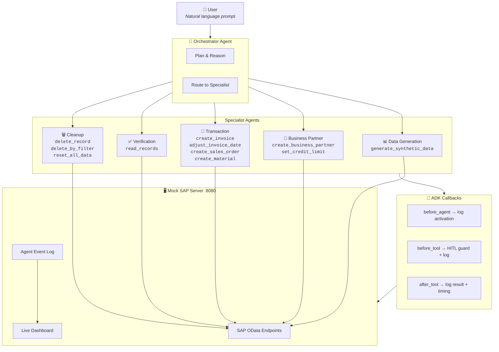

# 🧪 Synthetic Data Fabricator

> A **Multi-Agent System** built with [Google Agent Development Kit (ADK)](https://google.github.io/adk-docs/) that autonomously fabricates realistic synthetic test data in SAP systems using specialized AI agents.

**Trigger**: A natural-language request for a complex test scenario.
**Result**: An orchestrator plans, delegates to specialist agents, executes SAP API calls, and verifies — with full reasoning visibility and human-in-the-loop safety.

---

## 🏗️ Architecture



### Key Design Decisions

| Feature | Detail |
|---------|--------|
| **Orchestrator has zero tools** | Forces LLM-driven reasoning and delegation |
| **Specialist scoping** | Each sub-agent sees only its relevant tools — reduces prompt confusion |
| **HITL via `before_tool_callback`** | Destructive tools require explicit user approval before execution |
| **Structured error handling** | All HTTP calls return error dicts (never exceptions) so the agent can reason and retry |
| **Live event feed** | ADK callbacks emit structured events → dashboard polls → real-time visibility |

---

## 🚀 Quick Start

### 1. Clone & Setup

```bash
python3 -m venv .venv
source .venv/bin/activate
pip install -e ".[dev]"
```

### 2. Configure API Key

```bash
cp .env.example .env
# Edit .env and set your GOOGLE_API_KEY
```

### 3. Run the Agent

```bash
# CLI mode — mock server starts automatically
python run.py "Generate 5 overdue invoices for a US-based customer with a credit limit below \$5,000"

# Or use the default demo prompt
python run.py
```

### 4. Interactive Mode (ADK Web UI)

```bash
# Terminal 1: Start mock server
python3 -m mock_sap_server.app

# Terminal 2: Launch ADK web UI (best for HITL demos)
adk web .
#cd /Users/I771312/GoogleADK/synthetic-data-generator && .venv/bin/adk web .
```

### 5. View Results

Open **http://localhost:8080/** to see:
- **🧠 Agent Activity** — real-time event feed with agent reasoning, tool calls, timing, and HITL confirmations
- **📊 Entity tabs** — browse all Business Partners, Invoices, Sales Orders, and Materials

---

## ⚙️ Configuration

| Variable | Default | Description |
|----------|---------|-------------|
| `GOOGLE_API_KEY` | *(required)* | Your Gemini API key |
| `AGENT_MODEL` | `gemini-3-flash-preview` | LLM model for all agents |
| `MOCK_SAP_URL` | `http://localhost:8080` | Mock SAP server URL |

---

## 🧪 Demo Scenarios

The agent is **fully agentic** — the orchestrator autonomously plans, delegates, and verifies each scenario.

### 🔴 Scenario 1: Overdue Invoice Portfolio
```
Generate 5 overdue invoices for a US-based customer with a credit limit below $5,000
```
**Agent flow**: Orchestrator → Data Gen (plan data) → Business Partner (create BP + set credit limit < $5K) → Transaction (create 5 invoices, backdate dues) → Verification (read all, confirm Status = 'Overdue')

**What to watch**: The orchestrator reasons about the credit limit constraint, delegates material creation to the Transaction agent, and the Verification agent independently confirms all 5 invoices show `Overdue` status.

---

### 🟡 Scenario 2: Multi-Material Sales Order
```
Create a product catalog of 10 electronic components with realistic SKUs and prices, then create a sales order for a German customer referencing 3 of them
```
**Agent flow**: Orchestrator → Data Gen (10 materials) → Transaction (create materials) → Business Partner (create DE customer) → Transaction (create SO with 3 line items) → Verification

**What to watch**: The orchestrator splits this into phases — first building the product catalog, then creating the customer, and finally linking them via a sales order. Watch the Data Generation agent produce realistic component names and SKUs.

---

### 🟢 Scenario 3: Mixed-Status Customer Portfolio
```
Set up 3 US customers: one with paid invoices, one with overdue invoices, and one with no invoices at all
```
**Agent flow**: Orchestrator → Business Partner (create 3 BPs) → Transaction (paid invoices for BP1, overdue for BP2, skip BP3) → Verification (confirm different statuses across all 3)

**What to watch**: The orchestrator's reasoning — it must plan different treatment for each customer and ensure the Verification agent checks all three. Demonstrates agent planning with conditional logic.

---

### 🔵 Scenario 4: Credit Limit Stress Test
```
Create a customer with credit limit $10,000, add 2 paid invoices totaling $8,000, and 1 overdue invoice for $3,000 that exceeds the remaining limit
```
**Agent flow**: Orchestrator → Business Partner (create BP + $10K limit) → Transaction (2 paid invoices @ $4K, 1 overdue @ $3K with past due date) → Verification (confirm amounts, statuses, and limit overage)

**What to watch**: The agent must do arithmetic to ensure the paid invoices sum to $8K and the overdue one is $3K, pushing total exposure past the $10K limit. This tests the agent's reasoning about financial constraints.

---

### 🟣 Scenario 5: End-to-End Supply Chain
```
Create a complete supply chain scenario: a supplier with 5 raw materials, a customer, and 2 sales orders from the customer using those materials
```
**Agent flow**: Orchestrator → Business Partner (supplier) → Data Gen (5 materials) → Transaction (create materials) → Business Partner (customer) → Transaction (2 SOs) → Verification (full read-back)

**What to watch**: Multi-agent orchestration at its best — the orchestrator coordinates between Business Partner and Transaction agents multiple times, managing the dependency chain (supplier → materials → customer → orders).

---

### ❌ Scenario 6: Delete & Cleanup (HITL Demo)
```
Delete all overdue invoices from the system
```
**Agent flow**: Orchestrator → Verification (read invoices, identify overdue) → Cleanup (delete_by_filter) → **⏳ HITL confirmation dialog** → User approves → Cleanup executes → Verification (confirm deleted)

**What to watch**: The **Human-in-the-Loop** flow — when the Cleanup agent attempts deletion, ADK pauses and shows a confirmation dialog with details about what will be deleted. Only after user approval does the actual deletion proceed. This demonstrates responsible AI for destructive operations.

---

### 🔄 Scenario 7: Generate, Verify, Redo
```
Generate 3 invoices for a customer, then delete them and regenerate with different amounts
```
**Agent flow**: Part 1: BP → Invoices → Verify. Part 2: **HITL confirm delete** → Delete → Regenerate → Verify again.

**What to watch**: The full lifecycle — create, inspect, destroy (with approval), recreate. Shows the "I don't like this, redo it" workflow that makes the agent feel interactive and controllable.

---

## 📁 Project Structure

```
synthetic-data-fabricator/
├── .env.example                    # Environment variables template
├── pyproject.toml                  # Python project config
├── run.py                          # CLI entry point (color-coded output)
├── mock_sap_server/
│   ├── __init__.py
│   ├── app.py                      # Flask SAP OData mock + event log API
│   └── templates/
│       └── dashboard.html          # Live dashboard + Agent Activity tab
└── synthetic_data_agent/
    ├── __init__.py                  # Exports root_agent for ADK
    ├── agent.py                     # Multi-agent: orchestrator + 5 specialists
    ├── callbacks.py                 # ADK callbacks: logging, timing, HITL
    └── tools.py                     # 11 tool functions (CRUD + delete + reset)
```

---

## 🔒 Safety & Best Practices

- **No real SAP connection** — Local mock server; zero production risk
- **Human-in-the-Loop** — Destructive operations (delete, reset) require explicit user confirmation
- **Structured error handling** — All tools return error dicts; the agent reasons about failures gracefully
- **Self-verification** — The Verification agent independently reads back all records after creation
- **Idempotent reset** — `POST /admin/reset` clears everything; `DELETE /api/agent-events` clears the event log
- **Visible reasoning** — ADK callbacks surface every agent activation, tool call, and result in the live dashboard

---

## 🛠️ Definition of Done

For each scenario, the multi-agent system must:

1. ✅ **Plan** — Orchestrator reasons about the correct sequence and delegates to specialists
2. ✅ **Generate** — Data Generation agent produces realistic synthetic data (names, addresses, SKUs)
3. ✅ **Execute** — Specialist agents commit data to the mock SAP server via OData APIs
4. ✅ **Guard** — Destructive operations trigger HITL confirmation before execution
5. ✅ **Verify** — Verification agent reads back records and confirms correctness
6. ✅ **Report** — All created record IDs, statuses, and verification results are surfaced
